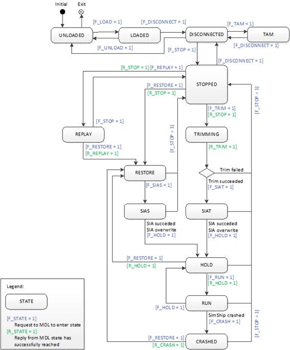

# EXAP simulation modelling standard

**Table of contents**

- [Introduction](#introduction)
- [Reference documents](#reference-documents)
- [Model Interface Variables](#model-interface-variables)
- [Communication modes](#communication-modes)
- [Model state machine](#model-state-machine)
- [Operating states](#operating-states)
- [Model Failure Handling](#model-failure-handling)
- [Snapshot functionality](#snapshot-functionality)
- [Preferences](#Preferences)

---
## 1. Introduction

The Extended Airbus Procedure (EXAP) is a standard for real-time simulation models. It specifies simulation states which have been identified to be necessary for training simulation. It also specifies principal mechanisms like model scheduling, model controlling or data flow.
A simulation model is called via its entry point by the simulation scheduler. The simulation environment determines the control state of the model by the control interface. The simulation environment provides input data before calling the model and reads output data after model execution. The model provides output data taking into account functional inputs, internal states and initial configuration parameters. The simulation time is set by the simulation environment. The Simulation Scheduler calls a model at a regular time interval.

---
## 2. Reference documents

| Ref. | Document title | Reference Number | Issue |
| :---- | :---- | :---- | :---- |
| R1 | Avionics Application Software \- Standard Interface, Part 1 – Required Services | ARINC 653 |  |
| R2 | Guidance For Design of Aircraft Equipment and Software For Use In Training Devices | ARINC Report 610 | C |

---
## 3. Model Interface Variables

In a  simulation model, three types of interface variables exist:
* Control flow variables: Enable the simulation environment to control the Simulation model.
* Data flow variables: Define the functional inputs and outputs produced or consumed from/to others models.
* Profile parameters: Enable to setup the model. 


### 3.1 Control Flow Variables

The control flow input variables below shall be implemented by all models.
These variables are input parameters set by the runtime environment. 
The control flow variable, denoted as “F\_\*” defines the simulation states in which the model currently operates.
The variables align with the state machine described in chapter 5\.

*Table 1: Control flow input variables*

| Name | Type | Description |
| :---- | :---- | :---- |
| **V\_DELTAT** | float | Time describing the scheduling of the model in seconds \[s\] |
| **V\_CETIME** | double | Absolute environment time in seconds \[s\] |
| **V\_Sim\_Id** | char256 | Simulator platform identification. Not refreshed while in state Running |
| **F\_LOAD** | int | 0: state Loaded is not requested; not 0: environment requests state Loaded from the model |
| **F\_RUN** | int | 0: state Run is not requested; not 0: environment requests state Run from the model |
| **F\_HOLD** | int | 0: state Hold is not requested; not 0: environment requests state Hold from the model |
| **F\_UNLOAD** | int | 0: state Unloaded is not requested; not 0: environment requests state Unloaded from the model |
| **F\_DISCONNECT** | int | 0: state Disconnected is not requested; not 0: environment requests state Disconnected from the model |
| **F\_STOP** | int | 0: state Stopped is not requested; not 0: environment requests state Stopped from the model |
| **F\_TRIM** | int | 0: state Trimming is not requested; not 0: environment requests state Trimming from the model |
| **F\_REPLAY** | int | 0: state Replay is not requested; not 0: environment requests state Replay from the model |
| **F\_RESTORE** | int | 0: state Restore is not requested; not 0: environment requests state Restore from the model |
| **F\_SIAS** | int | 0: state SIAS (System and Controls In Agreement after Snapshot) is not requested; not 0: environment requests state SIAS from the model |
| **F\_SIAT** | int | 0: state SIAT (System and Controls In Agreement after Trimming) is not requested; not 0: environment requests state SIAT from the model |
| **F\_CRASH** | int | 0: state Crashed is not requested; not 0: environment requests state Crashed from the model |
| **F\_TAM** | int | 0: state TAM (Test and Maintenance) is not requested; not 0: environment requests state TAM from the model |

The control flow ouput variables below shall be implemented by all models. 
They define the result of a calculation step of a simulation state, as described in the table below.

*Table 2: Control Flow Output variables*

| Name | Type | Description |
| :---: | :---: | :---: |
| **V\_CMTIME** | double | Absolute environment time (copy of V\_CETIME) in seconds |
| **V\_Model\_id** | char256 | Model Identification. Not refreshed while in state Running. |
| **R\_LOAD** | int | If state Loaded is required: 0, if an error occurred during Loading; 1, if Loading succeeded |
| **R\_RUN** | int | If state Run is required: 0, if an error occurred during Running; 1, if Running succeeded |
| **R\_HOLD** | int | If state Hold is required: 0, if an error occurred during Holding; 1, if Holding succeeded |
| **R\_UNLOAD** | int | If state Unloaded is required: 0, if an error occurred during Unloading; 1, if Unloading succeeded |
| **R\_DISCONNECT** | int | If state Disconnected is required: 0, if Disconnecting has not succeeded; 1, if Disconnecting succeeded |
| **R\_STOP** | int | If state Stopped is required: 0, if Stopped has not succeeded; 1, if Stopped succeeded |
| **R\_TRIM** | int | If state Trimming is required: 0, if Trimming has not succeeded; 1, if Trimming succeeded |
| **R\_REPLAY** | int | If state Replay is required: 0, if Replay has not succeeded; 1, if Replay succeeded |
| **R\_RESTORE** | int | If state Restore is required: 0, if Restore has not succeeded; 1, if Restore succeeded |
| **R\_SIAS** | int | If state SIAS (Systems and Controls in Agreement after snapshot) is required: 0, if SIAS has not succeeded; 1, if SIAS succeeded |
| **R\_SIAT** | int | If state SIAT (Systems and Controls in Agreement after trimming) is required: 0, if SIAT has not succeeded; 1, if SIAT succeeded |
| **R\_CRASH** | int | If state Crashed is required: 0, if Crashed has not succeeded; 1, if Crashed succeeded |
| **R\_TAM** | int | If state TAM (Test and Maintenance) is required: 0, if an error occurred during TAM; 1, if TAM succeeded |

### 3.2 Data Flow variables

Data flow variables implement the functional interface of the simulation model. From the model's perspective one cycle can be described as:
* Input variables are set by the environment
* The model is scheduled by the environment
* The model performs calculations and updates its outputs variables
* Output variables are read by the environment and forwarded to the input variables of receiving components

These data flow variables are formally documented in a Model Interface Control Document (MICD). Simulation and development environments often auto-generate these data flow parameters.
In case of models representing a Line Replaceable Unit (LRU), the model interface signal names must align with the LRU / A/V ICD signal names. 

The following data types are supported:
* Simple types, including arrays of those:
  * boolean
  * character
  * boolean
  * integer (signed/unsigned, 8-/16-/32-/64 bit)
  * float
  * double
* structure
* raw (byte array)

Note: Encoded messages must be sent as raw data as a simulation environment typically does not decode or interpret encoded data.

### 3.3 Profile Parameters

During the *Loading* state the model is permitted to load specific data from a file. A profile parameter defines the filename (including its path) for the data source. The profile data may be used to configure the model or to load datasets (e.g., aerodynamic data).

For C/C++ model implementation, the profile parameter shall be declared in the include file:  
*PROFIL\_C\_\<Model\>.h*

The simulation environment has access to the content of the parameter declared in the header file.
Below is an example of a profile header file defining parameters for a configuration file and a data file:

```c
#ifndef PROFIL_C_MDL_H_  
#define PROFIL_C_MDL_H_  
char config_file[256]; 
char data_file[256];
#endif /PROFIL_C_MDL_H_/
```

This example provides a reference for implementing profile parameters in C/C++-based simulation models, ensuring consistency and standardization across different models.

---
## 4. Communication Modes

The environment shall provide two communication modes for the model data flow:
* Sampling mode
* Queuing mode

Models may use both communication modes simultaneously. The selected communication mode(s) shall be defined in the model ICD.

### 4.1 Sampling mode

Sampling mode is the standard communication mode between models. According to the ARINC 653 \[R1\] definition, the sampling mode has the following characteristics:
* Successive messages carry identical but updated data.
* The message remains in the source port and may be overwritten.
* The message is transmitted via a channel that overwrites the previous message in the destination port(s).
* Unsegmented transmission (fixed message size).

This mode allows the producer to send messages at any time and allows the consumers to access the latest messages at random times.

### 4.2 Queuing mode

Queuing mode is necessary for models whose messages must not be overwritten, such as display systems requiring sequential data. According to \[R1\], queuing mode has the following characteristics:
* Messages are queued in both source and destination ports.
* Transmission follows a First-In-First-Out order.
* Message must not be lost.
* Segmented transmission is supported (fixed and variable message size)
* Processes may be blocked by timeout if queues are full or empty.
* The process queuing discipline is FIFO order

The simulation environment shall provide an API for queuing mode with the following queuing services.


*Table 3: API for queuing mode*

| Service | Associated function name | Description |
| :---: | :---: | :---: |
| **Port identification** | GetQueuingPortId | The service request enables the current model to obtain the identity of the ports associated with each of the functional input or output messages using the queuing mode. The port identification shall occur during the LOAD mode. |
| **Message sending** | SendQueuingMessage | The service request enables the current model to send messages. Models may write messages (functional outputs) toa port as long as the queue is not full. Messages are stored sequentially, and existing unread messages shall not be overwritten. |
| **Message reception** | ReceiveQueuingMessage | The service request enables the current model to receive messages. Models may read messages (functional inputs) from a port as long as the queue is not empty. Messages are read sequentially. |

---
## 5. Model State Machine
Figure 1 illustrates all simulation states for a model and the possible transitions between these states. 
Note: not all simulation states require a functional implementation. For instance, the Test and Maintenance state (TAM) is pertinent for simulation models interfacing with hardware components. In this state, the model might be required to perform a so-called “daily readiness test” to ensure the simulator’s proper functioning. This is typically necessary for certified training simulators (e.g. a CS-FSTD(A) \- level D simulator) but may not be required for engineering simulators. If a simulation model opts not to implement a simulation state, it must behave neutrally meaning: return TRUE for this state control variable and not reporting an error.


*Figure 1: Model state machine*




When **LOAD** is requested, the model performs its tasks for load mode and transition to the state *Loaded*. From there, it is possible to either **UNLOAD** the model or **DISCONNECT,**  which triggers the transition to the state *Disconnected*.
In the *Disconnected* state, the model has three possibilities:
1. The model can return to the Unloaded if requested.  
2. The instructor can select, join and assign main simulation components and proceed with the **STOP** trigger.  
3. The model can enter a special mode called *TAM* (Test And Maintenance) which can be exited by **DISCONNECT**. It is also possible to go back from the *Stopped* state to the *Disconnected* state.

From the *Stopped* state, there are three possibilities to proceed before the model reaches the next common state, *Hold*:
1. Trimming conditions are set and **TRIM** can be requested. If trimming fails, **STOP** is triggered. Otherwise, **SIAT** (System in Agreement after Trimming) is requested. In state *SIAT* it is checked if system status matches with trim results. *SIAT* can be overridden by the instructor if necessary.  
2. **RESTORE** can be requested. In the *Restore* state, the simulation framework provides previously stored internal model data together with previously stored input data to the model. After this state, **SIAS** (System in Agreement after Snapshot) is requested, where it is checked if system status matches with snapshot data. *SIAS* can be overwritten by the instructor if necessary.  
3. **REPLAY** can be requested. The *Replay* state is used for debriefing sessions, where the simulation framework sets recorded data to HMI related models. This state can be exited by triggering **RESTORE**.

After *SIAS* or *SIAT* the model transitions to the *Hold* state when **HOLD** is requested. 

Once all models have reached the *Hold* state, the *Run* state can be triggered by **RUN**. Run can be exited  by triggering **HOLD**. 

If the aircraft crashes, a special state *Crashed* is requested by **CRASH**. 

The *Restore* state can be reached from the *Stopped*, *Replay*, *Hold* or *Crashed* state by the associated trigger.

The *Stopped* state can be reached from the *Replay*, *Restore*, *SIAS*, *SIAT*, *Hold*, *Run*, *Crashed* or *Disconnected* state by the associated trigger. 

The *Disconnected state* can be reached from the *Stopped* or *TAM* state by the associated trigger.

The *Unloaded* state can be reached from the *Loaded* or *Disconnected* states  by the associated trigger.  

The model shall report an application error if a transition to a state cannot be completed successfully, with the exception that multiple cycles are allowed to reach the *Trimming* state.

---
## 6. Operating States

The following chapter details the simulation states and the behaviour of a simulation environment that executes (schedules) simulation models described in this standard.

### 6.1 State Unloaded

At simulation start-up, each model begins in the *Unloaded* state by default.
During runtime, this state is activated by the F\_UNLOAD variable.  This state operates in a non-real time mode and is executed in a single step, with no constraints on execution duration.  

The model inputs are:
* Control flow variables

The model outputs are:
* Control flow variables
* Safe functional outputs to prevent unsafe situations (e.g., when interacting with real hardware)

If applicable, the model shall perform the following tasks upon entering the state:
* Write date to output files
* Close output files
* Terminate network connections
* Free allocated memory

### 6.2 State Loaded

The *Loaded* state is activated by the F\_LOAD variable. This state operates in a non-real time mode and is executed in a single step, with no constraints on execution duration.  

The model inputs are:
* Control flow variables
* Profile parameter

The model outputs are:
* Control flow variables

If applicable, the model shall perform the following tasks upon entering the state:
* Open, read, and close profile data files (model-specific data files)
* Establish network connections
* Open output files
* Allocate memory
* Perform pre-computation to enhance computational efficiency in real time modes


### 6.3 State Run

The *Run* state is activated by the F\_RUN variable and operates in real-time mode.  

The model inputs are:
* Control flow variables
* Data flow variables

The model outputs are:
* Control flow variables
* Data flow variables

If applicable, the model shall perform the following tasks upon entering the state:
* Compute functional output data based on the functional input data.
* Support Speed Times N mode according to \[R2\].
* Implement freezes for air vehicule latitude/longitude, altitude, and fuel according to \[R2\]


### 6.4 State Hold

The *Hold*  state is activated by the F\_HOLD variable and operates real-time mode. This state is characterized by a freeze of time integration, meaning the model does not advance in time but remains in the same state as the previous step. The model shall behave as in state Running.  

The model inputs are:
* Control flow variables
* Data flow variables

The model outputs are:
* Control flow variables
* Data flow variables

If applicable, the model shall perform the following tasks upon entering the state:
* Calculate the functional output data from the functional input data.
* The output data shall be as in the step before.

### 6.5 State Disconnected

The *Disconnected* state is activated by the F\_DISCONNECT variable. In this state, the instructor can select, join and assign main simulation components.  

The model inputs are:
* Control flow variables

The model outputs are:
* Control flow variables

If applicable, the model shall perform the following tasks upon entering the state:
* The model itself has no active task in this state.


### 6.6 State Stopped

The *Stopped* state is activated by the F\_STOP variable and operates in real-time mode. In this state, the instructor can set trimming conditions. This state may span several execution steps.  

The model inputs are:
* Control flow variables

The model outputs are:
* Control flow variables
* Data flow variables set to default values
* These values act as 'seed values' for the first iteration of the Trim phase.

If applicable, the model shall perform the following tasks upon entering the state:
* Initialize internal variables.
* Ensure initialization does not depend on:
  * functional data from other models
  * past simulation run

### 6.7 State Trimming

The *Trimming* state is activated by the F\_TRIM variable and operates in real time mode. Reaching this state successfully may require several execution steps. 

The purpose of this state is to determine an aircraft configuration (e.g., throttle position, control surface deflections) where the resultant forces and moments are in an equilibrium for a given flight condition (e.g., speed, altitude), i.e., the aircraft is in a stable steady state.

The models influenced by the trimming process should be grouped into a trim group. All models within this group are activated by the simulation environment until the master of the group (the trim model) identifies a suitable parameter set. Upon successful identification, the trim model sends a successful return flag (R\_TRIM \= 1\) back to the simulation environment.

During the trimming process, hysteresis effects, physical delays, and time-dependent filters are not permitted.

The model inputs are:
* Control flow variables
* Data flow variables

The model outputs are:
* Control flow variables
* Data flow variables

If applicable, the model shall perform the following tasks upon entering the state:
* Complete initialization. Data flow parameters can be taken into account.
* Stabilize the model as quickly as possible. That means e.g. that delays in actuation or time constants of filters shall be set to zero.
* Apply changes in air vehicle position, attitudes, heading and velocities as specified in \[R2\].


### 6.8 State Replay

The *Replay* state is activated by the F\_REPLAY variable and operates in real-time mode. In this state, the simulation environment injects recorded model outputs, allowing for playback of previous simulation data. This state is typically used for debriefing sessions and analysis.  

The model inputs are:
* Control flow variables
* Data flow variables

The model outputs are:
* Control flow variables
* Data flow variables

If applicable, the model shall perform the following tasks upon entering the state:
* Display the injected (recorded) data to ensure accurate visualization of past simulation events.

### 6.9 State Restore

The *Restore* state is activated by the F\_RESTORE variable and operates in real-time mode. In this state, the simulation environment sets stored input signals for each model and restores model internal variables from a previously saved snapshot.  

The model inputs are:
* Control flow variables
* Data flow variables

The model outputs are:
* Control flow variables
* Data flow variables

If applicable, the model shall perform the following tasks upon entering the state:
* Set internal states according to provided snapshot data.
* Compute functional output data based on the functional input data.


### 6.10 State SIAS

The state *System in Agreement after Snapshot (SIAS)* is activated by the F\_SIAS variable and operates in a real-time mode. This state ensures the synchronization of equipment elements after a snapshot initialization. If disagreements between the restored system state and the expected state have been detected, they shall be resolved by:
* Setting the equipment element to the requested state, or
* Overwriting the trim result with the actual state of the equipment element.

The model inputs are:
* Control flow variables
* Data flow variables

The model outputs are:
* Control flow variables
* Data flow variables

If applicable, the model shall perform the following tasks upon entering the SIAS state:
* Publish functional output data to reflect the resolved system state.


 ### 6.11 State SIAT

The *System in Agreement after Trim (SIAT)* state is activated by the F\_SIAT variable and operated in real-time mode. This state ensures the synchronization of equipment elements with trim results obtained in the *Trimming* state. If disagreements between the trim results and the actual system state are detected, they shall be resolved by:
* Setting the equipment element to the requested state, or
* Overwriting the trim result with the state of the equipment element.

The model inputs are:
* Control flow variables
* Data flow variables

The model outputs are:
* Control flow variables
* Data flow variables

If applicable, the model shall perform the following tasks upon entering the state:
* Publish functional output data to reflect the resolved system state.


### 6.12 State Crashed

The *Crashed* state is activated by the F\_CRASH variable. This is a special state that is triggered when the ownship has been destroyed or has crashed.

The model inputs are:
* Control flow variables
* Data flow variables

The model outputs are:
* Control flow variables
* Data flow variables

If applicable, the model shall perform the following tasks upon entering the state:
* Trigger and display visual effects to represent the crash event
* Suppress undesired movements of hardware equipment to prevent unintended mechanical action


### 6.13 State TAM

The *Test And Maintenance (TAM)* state is activated by the F\_TAM variable and operate in rea-time mode. This state is used for task such as performance measurement, diagnostics, and test cases.  

The model inputs are:
* Control flow variables
* Data flow variables

The model outputs are:
* Control flow variables
* Data flow variables

If applicable, the model shall perform the following tasks upon entering the state:
* Compute the functional output data based on the functional input data.
* Support special tasks required for test and maintenance operations.

---
## 7. Model Failure Handling

Simulation models may implement failure handling and/or logging mechanisms to detect  and manage runtime errors that occur during execution. Implementing failure handling allows the simulation control entity to:

* Monitor failures and react accordingly  
* Reset or shut down the simulation safely to prevent cascading errors.

While failure handling is not mandatory, it is strongly recommended to ensure simulation stability and maintainability.


### 7.1 Model Error Parameter

To facilitate error detection and management, a control variables *R\_ERROR* is defined to provide a standardized mechanism for reporting errors to the simulation environment:
* 0, to indicate that the model code is not responding to any simulation state execution request ;
* \-1, to indicate that the model code is executing the required simulation state correctly;
* any strictly positive value, to indicate an error or a warning in the execution of the required simulation state.

All strictly positive values of *R\_ERROR*, along with their corresponding error/warning description, shall be documented in the model specification. This may include a predefined set of errors and warnings to ensure consistency.

The difference between an error and a warning is that the error prevents the successful execution of the simulation state (*R\_\<state\>* goes to *False*) while the warning allows execution to continue (*R\_\<Mode\>* goes to *True*) but indicates an issue .

Optionally, a string output variable (with "Type" \= "char" and "Dim1/Dim2" \= "1024/1") can be added to the model interface in order to provide information about the raised error or warning. Such a subject will have to be addressed within the model specification.

### 7.2 Logging Mechanism

The simulation framework provides a logging mechanism to ease development and integration of simulation models. All models have to use and implement this service for logging messages. And more specific: a simulation model shall never log to a console output directly.
Log messages can define the following levels of criticality:
* trace
* debug
* info
* warning
* error
* fatal

A simulation environment can then be configured, depending on the defined log level, which messages are displayed to the user on a console or which are written to a log file. 

The service can be accessed via macro which behave like the c-function printf(), e.g.
* `LOG_TRACE("text")`
* `LOG_DEBUG("text")`
* `LOG_INFO("text")`
* `LOG_WARNING("text")`
* `LOG_ERROR("text")`
* `LOG_FATAL("text")`

Format specifiers can be used with the following macros:
* `LOG_TRACE("text %d", integerVariable)`
* `LOG_DEBUGF("text %d", integerVariable)`
* `LOG_INFOF("text %d", integerVariable)`
* `LOG_WARNING("text %d", integerVariable)`
* `LOG_ERROR("text %d", integerVariable)`
* `LOG_FATAL("text %d", integerVariable)`

Especially in the real time states it is important to judge logging output and levels very wisely. It is not advised to flood logging outputs with messages which are not relevant.

---
## 8. Snapshot Functionality

If a model uses an internal state machine for its calculations or employs time-dependent controllers/filters, it must implement store and restore functionality. This functionality is triggered by the simulation environment when needed.

To store a snapshot, the model must export the following function:
`void model_serialize(const void*, size_t);`

To restore a snapshot, the model must export the following function:
`void model_deserialize(const void*, size_t);`

The *model\_serialize* function, when called with its first parameter set to NULL, requests the memory block size of the snapshot data. While this size does not have to be constant, it is recommended for consistency.

When a snapshot is taken by the snapshot service, the model\_serialize function is called a second time. In this instance, its first parameter provides a pre-allocated memory block of the size retrieved by the first *model\_serialize* call. The model should then fill the memory block with its internal data.
To restore the snapshot, the model\_deserialize function is called. Its parameters provide a memory block with the snapshot data, and the model should restore its internal state accordingly.

